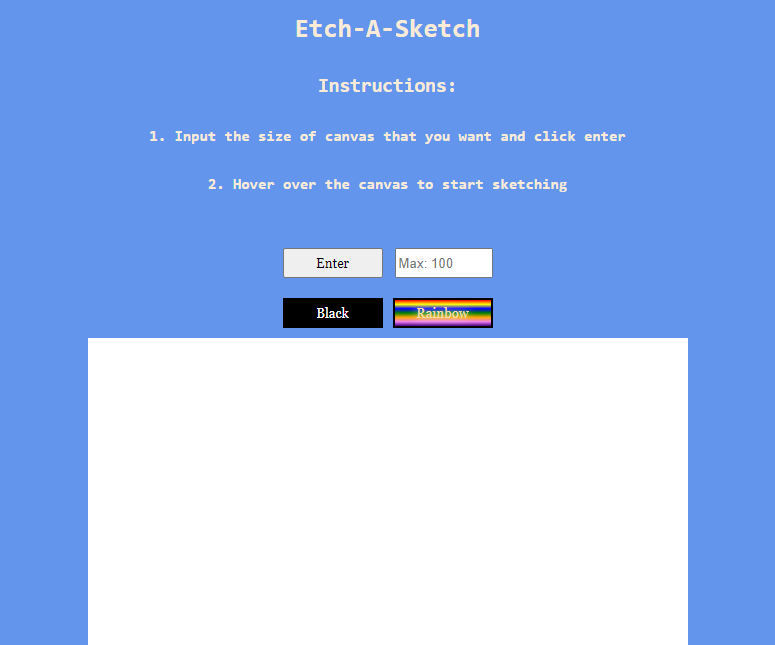
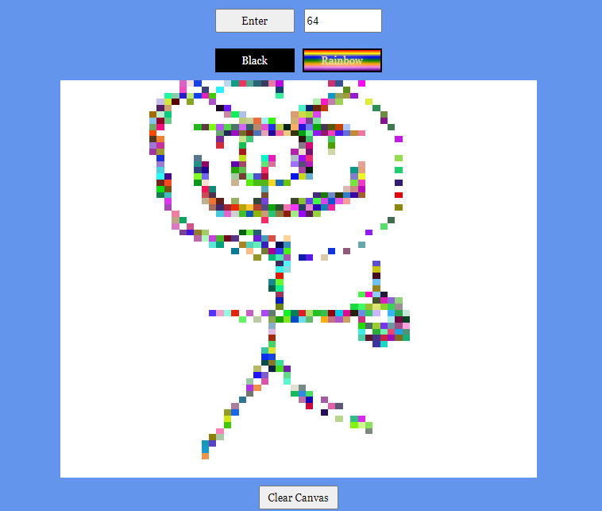

# Etch-A-Sketch
## Description:
An **Etch A Sketch** project where I used `JavaScript` to create the square divs instead of copy pasting from the `HTML`. This increased my skills, and is also a good practice for **DOM Manipulation**.  

### Preview:

